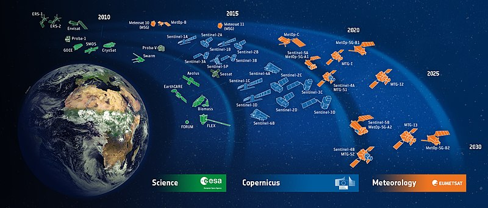

# Technology

The project utilizes data from the Copernicus Emergency Management System, a comprehensive source of information for managing natural disasters and other emergencies. This data is used to monitor the status of critical infrastructure such as water supplies, power plants, and communication networks.

In addition, the project incorporates open data on the locations of critical strategic infrastructure. This data is appended on a map, providing a visual representation of the infrastructure’s location relative to the affected area.
